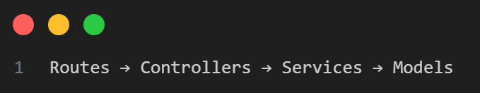

<br>

# Backend API 

<div align="center">

### Secure • Scalable • Analytics-Ready • Production-Grade REST API


A **production-ready backend API** for managing  
**personal expenses & income**, featuring  
**JWT authentication**, **MongoDB aggregation analytics** and **clean architecture**.

</div>

---

## 📌 Project Overview

### 🎯 Project Objective
Build a **robust, secure and scalable backend** that:
- Tracks **expenses & income**
- Provides **financial analytics**
- Supports **JWT-based authentication**
- Follows **industry-standard backend architecture**

### ✅ What This Project Delivers
✔ Secure Node.js & Express backend  
✔ MongoDB + Mongoose integration  
✔ JWT authentication & protected routes  
✔ User-scoped financial data  
✔ Aggregation-based analytics (weekly, monthly, category)  
✔ Clean, maintainable, scalable architecture  

---

## 🛠 Tech Stack

| Layer | Technology |
|------|------------|
| Backend | Node.js, Express.js |
| Database | MongoDB, Mongoose |
| Authentication | JWT (JSON Web Tokens) |
| Security | bcrypt, express-rate-limit |
| Environment | dotenv |
| Tools | Postman, VS Code |

---

## 🏗 Backend Architecture



<br>


✔ No business logic in routes  
✔ Controllers are thin  
✔ Services handle all logic  
✔ Models are schema-only  

This ensures **scalability**, **testability** and **clean separation of concerns**.

---

## 🗄 Database Design

### 👤 User Schema
- name  
- email (unique)  
- password (bcrypt hashed)  
- timestamps  

---

### 💸 Expense Schema
- userId (reference to User)  
- amount  
- category (Food, Travel, Rent, Shopping, Other)  
- description  
- date  
- month (derived internally)  
- year (derived internally)  
- timestamps  

---

### 💰 Income Schema
- userId  
- source  
- amount  
- date  
- month (derived internally)  
- year (derived internally)  
- timestamps  

⚠️ **Month & Year are never taken from client**  
✔ Always derived in service layer


---

### 📅 Month & Year Derivation (Server-Side)

To maintain data integrity and prevent client-side manipulation **month and year are derived on the server from the provided date**.

Below is a **very simple line-by-line explanation** 

---

```js
exports.extractMonthYear = (date) => {
```

• Creates a reusable function
• Takes **date** as input from request

---

```js
  const d = new Date(date);
```

• Converts the input date string into a JavaScript `Date` object
• Example: `"2025-12-02"` → `Date object`

---

```js
  if (isNaN(d.getTime())) {
```

• Checks whether the date is **valid or not**
• Invalid dates return `NaN`

---

```js
    throw new Error('Invalid date format');
```

• Stops execution if the date is invalid
• Prevents wrong data from being saved

---

```js
  return {
```

• Returns derived values to the service layer

---

```js
    month: d.getMonth() + 1,
```

• `getMonth()` gives values from **0–11**
• Adding `+1` converts it to **1–12**

---

```js
    year: d.getFullYear()
```

• Extracts the full year (e.g. `2025`)

---

```js
  };
};
```

• Sends month & year back to the service
• These values are saved in the database

---


✔ Ensures accurate monthly and yearly analytics
✔ Prevents client-side manipulation
✔ Keeps backend as the single source of truth

---

## 🔐 Authentication

Authentication is implemented using **JWT (Bearer Token)**.

### ✅ Features
- User registration  
- User login  
- Password hashing with bcrypt  
- JWT token generation & expiry  
- Protected APIs  

### 🔑 Auth Endpoints

| Method | Endpoint |
|------|----------|
| POST | `/api/auth/register` |
| POST | `/api/auth/login` |
| GET | `/api/auth/me` |

---

## 💸 Expense APIs

| Method | Endpoint |
|------|----------|
| POST | `/api/expenses` |
| GET | `/api/expenses/weekly` |
| GET | `/api/expenses/summary/category` |
| GET | `/api/expenses/summary/monthly?month=&year=` |
| GET | `/api/expenses/balance` |
| DELETE | `/api/expenses/:id` |

---

## 💰 Income APIs

| Method | Endpoint |
|------|----------|
| POST | `/api/income` |
| GET | `/api/income?month=&year=` |

---

## 📊 Business Logic & Analytics

✔ Weekly expense (last 7 days rolling window)  
✔ Monthly expense summary  
✔ Category-wise aggregation  
✔ Remaining balance calculation  
✔ MongoDB aggregation pipelines  
✔ Fully user-scoped analytics  

---

## 🔁 API Response Example

### ✅ Register User – POST `/api/auth/register`

**Request**
```json
{
  "name": "Satyam Kumar",
  "email": "satyam@test.com",
  "password": "123456"
}
````

**Response**

```json
{
  "success": true,
  "message": "Success",
  "data": "<JWT_TOKEN>"
}
```

---

### ✅ Add Expense – POST `/api/expenses`

**Headers**

```
Authorization: Bearer <JWT_TOKEN>
```

**Request**

```json
{
  "amount": 500,
  "category": "Food",
  "description": "Lunch",
  "date": "2025-12-02"
}
```

**Response**

```json
{
  "success": true,
  "message": "Success",
  "data": {
    "amount": 500,
    "category": "Food",
    "month": 12,
    "year": 2025
  }
}
```

---

### ✅ Remaining Balance – GET `/api/expenses/balance`

```json
{
  "totalIncome": 50000,
  "totalExpense": 18000,
  "remainingBalance": 32000
}
```

---

## ⚠ Validation & Error Handling

### ✅ Handled Scenarios

* Missing required fields
* Invalid credentials
* Unauthorized access
* Invalid resource IDs
* Server errors

### ✅ HTTP Status Codes

| Scenario     | Code |
| ------------ | ---- |
| Success      | 200  |
| Created      | 201  |
| Bad Request  | 400  |
| Unauthorized | 401  |
| Not Found    | 404  |
| Server Error | 500  |

---

## 🔒 Security Enhancements

✔ Password hashing (bcrypt)
✔ JWT protected routes
✔ Rate limiting on auth APIs
✔ No sensitive data in responses
✔ User-scoped database access

---

## 🧪 API Testing (Postman)

✔ All APIs tested using Postman
✔ Positive & negative test cases covered
✔ JWT authentication validated
✔ Rate-limit tested
✔ Unauthorized access blocked

---

## ▶ Run Backend Locally

```bash
npm install
npm run dev
```

Server runs at:

```
http://localhost:5000
```

---

## 👥 Developer

<table align="center">
  <tr>
    <td align="center">
      <br>
      <strong>Satyam Kumar</strong><br>
      <a href="https://github.com/Satyaamp">@Satyaamp</a>
    </td>
  </tr>
</table>

---

<div align="center">

### ⭐ Built with clean architecture, security & scalability in mind

</div>

